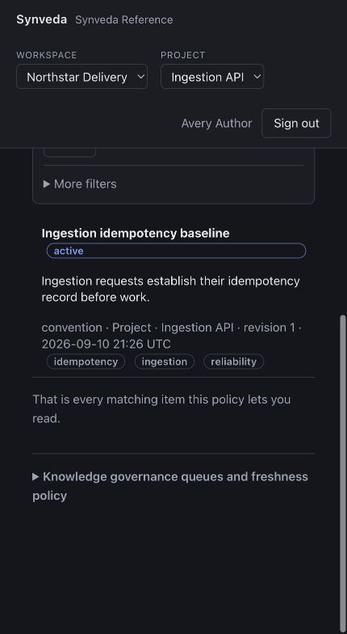

# Synveda

AI agents are good at using the information in front of them and bad at
carrying trustworthy information from one run to the next. Synveda gives an
individual or team one governed place for three things:

- **Knowledge** — reviewed facts, decisions, conventions and procedures with
  immutable revisions and provenance;
- **Context** — the exact, policy-visible Knowledge selected for one agent
  Session under a bounded token budget; and
- **Skills** — versioned instructions distributed to the right projects and
  principals only after the required review.

For example, an agent investigating an ingestion failure can record that
retries must reuse the original `Idempotency-Key`. Synveda preserves the
Session evidence, lets a reviewer decide whether that learning becomes active
Knowledge, and can give the approved revision and matching retry Skill to a
later agent. Teams that need durable agent memory without losing ownership,
scope, review or audit boundaries are the intended users.

Synveda is a memory and context control plane, not an agent framework, chat
application, orchestrator or vector-database wrapper. Agent clients use its
public APIs; the server remains the authority.

> **Current status: useful local evaluation, not production-ready.** The
> source-checkout Docker demo has passed one clean-volume run on macOS with
> OrbStack. Linux, Docker Desktop, reference HTTPS, published-release,
> production backup/PITR, key-custody and high-availability evidence remain
> open. See [Production readiness](docs/PRODUCTION_READINESS.md) for the
> maintained limitations and exit criteria.



The screenshot is from the real seeded console in this checkout. The names and
content are fictional demo data; no credential or secret is shown.

## Quick start from a source checkout

This path builds and runs the product from source. It is distinct from the
currently unverified [packaged-reference workflow](docs/INSTALL.md#packaged-reference).
Do not copy a local `.env`: the lifecycle reads checked-in non-secret defaults
and creates private project inputs under the ignored deploy/compose/runtime
directory.

### Host prerequisites

The host needs:

- Git and network access for the checkout, base images and build dependencies;
- a non-root Unix account and a local Docker Engine 28 or newer, reached over
  its Unix socket (remote Docker contexts are refused);
- Docker Compose 2.33.1 or newer and Buildx using the running `default` builder
  with the local `docker` driver;
- Node.js 22 or newer, OpenSSL and GNU Make; and
- permission to review and install two loopback-only `/etc/hosts` entries.

No CPU, memory or disk minimum has been established. Docker runs PostgreSQL 17,
production-mode Keycloak, Caddy, the Synveda gateway and worker, and the private
OpenTelemetry Collector in containers. Rust is not needed to start that graph;
the optional seeded CLI tour below additionally needs the repository's pinned
Rust toolchain.

The only completed platform run is macOS 26.6.2 arm64 with OrbStack Docker
Engine 29.4.0 and Compose 5.1.2. The implementation targets Unix hosts, but
Linux and Docker Desktop repetition is still pending; that is not a support
claim for those platforms.

### 1. Clone and prepare the development names

```sh
git clone https://github.com/synveda/synveda.git
cd synveda

make compose-hosts-plan
make compose-hosts-status
SYNVEDA_CONFIRM_HOSTS_INSTALL=install:127.0.0.1:synveda-development:app.synveda.test:auth.synveda.test \
  make compose-hosts-install
```

The install target is the one consent-requiring host change. Review the plan
and exact confirmation before allowing its privilege escalation; do not run
Make or Docker generally as root. Then flush the host's resolver cache. On
macOS:

```sh
sudo dscacheutil -flushcache
sudo killall -HUP mDNSResponder
```

On a Linux host using `systemd-resolved`:

```sh
sudo resolvectl flush-caches
```

Finish the prerequisite before starting the stack:

```sh
make compose-hosts-status
make compose-resolver-check
```

Development is explicit loopback HTTP and needs no certificate. Reference mode
is a separate HTTPS workflow: real DNS and matching mode-0600 certificate/key
files must exist **before** `make compose-config` or `make compose-up`. Follow
[Reference HTTPS](deploy/compose/README.md#reference-https); ACME and automatic
renewal are not implemented.

### 2. Configure, start and check the demo

```sh
export SYNVEDA_COMPOSE_PROFILES=demo
make compose-config
make compose-up
make compose-smoke
```

`compose-up` generates missing mode-0600 secrets, writes the bundled issuer
contract, builds the development images, creates the isolated database roles,
applies the schema, converges Keycloak and starts the gateway and worker. It is
safe to rerun and does not rotate existing secrets. The `demo` profile creates
three Keycloak demo identities; it does not bypass the public API to insert
product data.

Open [http://app.synveda.test:8080/console/](http://app.synveda.test:8080/console/).
Sign in as `synveda-demo-admin`, displayed in Synveda as **Avery Author**. Its
password is in:

```text
deploy/compose/runtime/synveda-development/secrets/keycloak_demo_admin_password
```

`compose-up` prints the resolved URL and all three password-file paths, never
the passwords. Read the file only through a local password-input mechanism; do
not put its contents in a command, log or committed file. On a completely fresh
product database, the console opens **Getting started** and asks you to create a
workspace, create its first project, attach a repository, choose an agent
client, copy its connection commands and run the connection check. The header
then shows your selected workspace/project and the left navigation starts with
**Home**, **Sessions**, **Knowledge**, **New Learnings**, **Context** and
**Skills**.

### 3. Seed the governed Northstar example (optional)

The normal first-run UI is ready after step 2. To reproduce the real records in
the screenshot, build the existing source CLI and create three local login
profiles:

```sh
cargo build --locked -p synveda-cli
export SYNVEDA_GATEWAY=http://app.synveda.test:8080
export SYNVEDA_INSECURE_DEVELOPMENT_HTTP=true

./target/debug/synveda login --gateway "$SYNVEDA_GATEWAY" --profile author --no-browser
./target/debug/synveda login --gateway "$SYNVEDA_GATEWAY" --profile reviewer --no-browser
./target/debug/synveda login --gateway "$SYNVEDA_GATEWAY" --profile viewer --no-browser
```

Open each printed URL in a fresh private browser session and use the matching
local credential:

| Profile | Keycloak account | Password file |
| --- | --- | --- |
| `author` | `synveda-demo-admin` (Avery Author) | `keycloak_demo_admin_password` |
| `reviewer` | `synveda-demo-member` (Riley Reviewer) | `keycloak_demo_member_password` |
| `viewer` | `synveda-demo-viewer` (Vera Restricted Viewer) | `keycloak_demo_viewer_password` |

All three password files are in the generated
deploy/compose/runtime/synveda-development/secrets directory. Once the logins
finish:

```sh
./target/debug/synveda demo retry-review seed \
  --author-credentials author \
  --reviewer-credentials reviewer \
  --viewer-credentials viewer \
  --confirm-target "$SYNVEDA_GATEWAY"
./target/debug/synveda demo retry-review inspect --author-credentials author
```

The resumable seed uses public APIs. It creates the **Northstar Delivery**
workspace and **Ingestion API** project, one approved baseline Knowledge
revision, one open Skill proposal and one synthetic Session. It deliberately
stops before Capture so that review remains visible.

## A five-click tour

After the optional seed, sign in to the console as Avery Author:

1. On **Home**, confirm the header says **Northstar Delivery** and
   **Ingestion API**.
2. Click **Sessions**, then **Synthetic replay: determine ingestion retry
   behaviour**. Its **Timeline** contains one `message.assistant`; **Capture
   evidence** says no snapshot has been frozen yet.
3. Click **Knowledge**, then **Ingestion idempotency baseline**. It is an active
   project `convention`, revision 1, with the summary “Ingestion requests
   establish their idempotency record before work.”
4. Under **Advanced**, click **Reviews**. The seeded `install Skill` proposal
   for `ingestion-api` is open; **Skills** truthfully remains empty until its
   governed change is reviewed and applied.
5. Continue with the [governed ingestion-retry walkthrough](deploy/compose/README.md#governed-ingestion-retry-walkthrough)
   to Capture the Session, observe Vera's denied review, let Riley review and
   Avery apply, bind the exact Skill version, and request Context that cites the
   resulting Knowledge revision.

This is deterministic synthetic replay: it needs no model API, paid service or
agent subscription. `make compose-acceptance` is the disposable automated
version and also exercises the restart matrix; its reviews are labelled test
acts, not human review. Claude Code replay and live-client verification are
separate gates, and optional semantic retrieval needs the documented TEI
fixture. External OIDC, PostgreSQL and OTLP endpoints are optional operator
integrations, not first-run prerequisites or currently verified provider
claims.

## Operate or remove the local stack

Keep the same `SYNVEDA_*` selectors for every command. For the default demo:

```sh
SYNVEDA_COMPOSE_PROFILES=demo make compose-smoke
docker logs --tail 200 synveda-development-gateway-1
docker logs --tail 200 synveda-development-worker-1

SYNVEDA_COMPOSE_PROFILES=demo make compose-down
SYNVEDA_COMPOSE_PROFILES=demo make compose-up
```

`compose-down` is the non-destructive stop: it preserves PostgreSQL data and
the generated project inputs. The following reset is different and destructive.
The first command intentionally refuses and prints the required project-bound
confirmation; for the unchanged default selectors, the confirmed command is:

```sh
SYNVEDA_COMPOSE_PROFILES=demo make compose-reset
SYNVEDA_COMPOSE_PROFILES=demo SYNVEDA_CONFIRM_RESET=synveda-development make compose-reset
```

Reset removes this Compose project's containers, networks and PostgreSQL data
volume, plus selected disposable browser, metrics or Apalis volumes. It does
**not** remove the project's issuer document, demo passwords, database
credentials or KMS key/reference. It is deployment reset, not tenant erasure.
The managed `/etc/hosts` block also remains until you use the separately
confirmed [hostname removal procedure](deploy/compose/README.md#removing-development-hostname-ownership).

## Troubleshooting the first run

| Symptom | Check |
| --- | --- |
| Docker is unavailable or the lifecycle refuses the context | Start the operator-owned local Engine, select its local Unix-socket context, and check `docker version`, `docker compose version` and `docker buildx inspect default`. Synveda does not install or supervise Docker. |
| `app.synveda.test` or `auth.synveda.test` does not resolve | Run `make compose-hosts-status`, inspect `make compose-hosts-plan`, flush the active resolver cache, then run `make compose-resolver-check`. The manager refuses foreign, duplicate or drifted ownership instead of rewriting it. |
| Sign-in loops, discovery fails or the callback is rejected | Use the exact printed `http://app.synveda.test:8080/console/` URL, not `localhost`; verify both `.test` names, clear stale IdP cookies with a private window, and rerun `make compose-smoke`. Browser, gateway, discovery and token issuer authorities must match exactly. |
| Port 8080 is already in use | Stop the process that owns loopback port 8080, or set one unused `SYNVEDA_DEV_HTTP_PORT` before every hostname/config/start command. Do not change selectors halfway through a project lifecycle. |
| Reference HTTPS is refused | Install real DNS first, then a leaf-first PEM chain and matching unencrypted mode-0600 private key. The preflight checks format, adjacency, key match, hostname and remaining validity; it does not create or renew certificates or justify bypassing a browser warning. |
| Startup stops during initialization | Read the bounded gateway/worker logs above and rerun `make compose-up`; it converges existing secrets and jobs. `synveda init` is intentionally a side-effect-free refusal. An older pre-1.0 database is not migrated and requires the explicit project reset. |
| A prerequisite is genuinely missing | Install the named host tool/version, then rerun `make compose-config` and `make compose-up`. Missing Docker, Buildx, Node, OpenSSL, Make, DNS or credentials is unavailable evidence, not a passing result. |

The [canonical Compose guide](deploy/compose/README.md) owns the full selector,
recovery, reference HTTPS, external-provider, observability and lock-recovery
procedures.

## Client support

`adapters/registry.json` is the support authority. The
[generated client-support matrix](docs/CLIENT_SUPPORT.md) is its checked
projection and distinguishes configuration, authentic captured frames,
deterministic replay and live verification.

Claude Code 2.1.241 is the only verified lifecycle. Other clients remain at
their evidenced registry level; a connection recipe or generic MCP
configuration is not lifecycle support.

## Known production gaps

[Production readiness](docs/PRODUCTION_READINESS.md) owns the complete gap
register. In particular, a successful local demo does not establish published
artifact parity, signing, production recovery or key custody, HA, SaaS or Helm
production readiness.

The repository currently has no `LICENSE` grant while generated OpenAPI
metadata says `Proprietary`. That metadata is not complete distribution or use
terms. An owner/legal decision is still required; the permissive dependency
policy does not license Synveda itself.

## Documentation

- [Install and use the product](docs/INSTALL.md) covers Sessions, Capture,
  Knowledge, Context, Skills, Tools, governance and the distinct packaged
  workflow.
- [Client support](docs/CLIENT_SUPPORT.md) and the [Claude Code adapter](adapters/claude-code/README.md)
  cover the only currently verified agent lifecycle and the optional generic
  MCP integration.
- [Contributing](CONTRIBUTING.md), [agent rules](AGENTS.md) and the
  [feature inventory](docs/backlog/STATUS.md) define the development workflow.
- [Product principles](docs/SYNVEDA_SEED.md), the [technical plan](docs/SYNVEDA_TECH_PLAN.md),
  [ADR index](docs/adr/README.md) and [security model](docs/SECURITY.md) describe
  the trust and architecture boundaries.
- [Deployment overview](deploy/README.md), the [deployment contract](docs/DEPLOYMENT_CONTRACT.md)
  and [production readiness](docs/PRODUCTION_READINESS.md) separate implemented
  local behaviour from unsupported production claims.
- The generated [OpenAPI contract](docs/api/openapi.json) and
  [benchmarks](docs/BENCHMARKS.md) own application and measured-performance
  claims.

Every application read and write is decided by the embedded Cedar policy
engine; PostgreSQL forced row-level security is the tenant-isolation backstop;
governed mutations use VedaFlow; and the audit chain retains content-minimised
evidence. Deployment mode and demo data do not bypass those boundaries.
