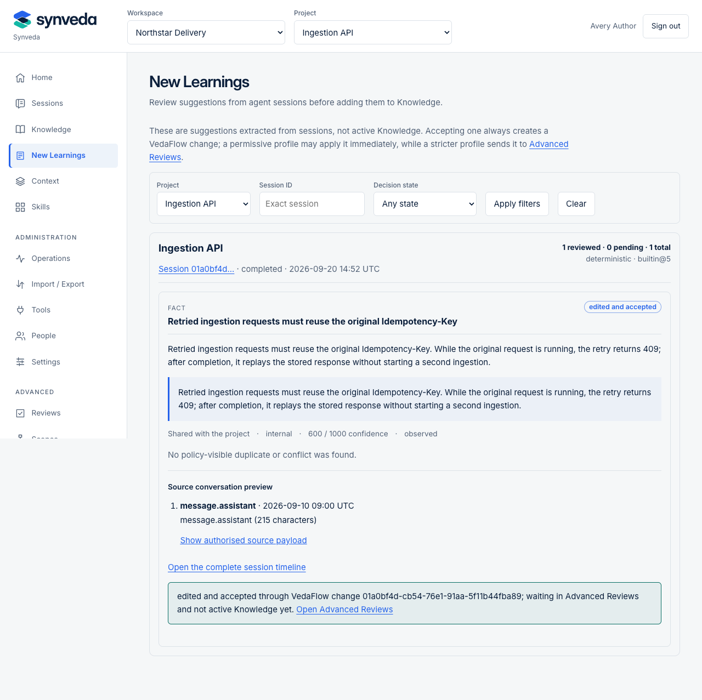

<picture>
  <source media="(prefers-color-scheme: dark)" srcset="assets/brand/synveda-lockup-dark.svg">
  
</picture>

# Synveda

**Governed knowledge, context and skills for AI agents.** Synveda helps
individuals and teams reuse what agents learn: capture a finding from a Session,
review the proposed change, and make an approved Knowledge revision available
to later tasks. PostgreSQL stores the data, Cedar decides access, and the web
console shows the evidence and review history. Run it on your own infrastructure.

Synveda is a memory and context control plane, not an agent framework,
orchestrator or vector database wrapper. Agents run in their existing clients.



The screenshot shows the synthetic sample, not a live-agent or human-review claim.

## Run with Docker

The current public first run uses the **prebuilt v0.4.0 bundle**, bundled PostgreSQL
and Keycloak, and generated private credentials. You need a local Docker Engine
28+, Compose 2.33.1+, curl, tar and a SHA-256 utility; start with 6 GiB available
to Docker. No compiler, hostname edit, cloud account or model subscription is
needed. Linux AMD64/ARM64 release installation is verified; macOS/OrbStack has
local candidate evidence. Docker Desktop and Windows/WSL2 remain unqualified.

<!-- installation-version: 0.4.3; publication: unreleased -->
The [v0.4.1 tagged run](https://github.com/synveda/synveda/actions/runs/35900269117)
stopped at the anonymous image check, before installation qualification or
release publication. The [v0.4.2 tagged run](https://github.com/synveda/synveda/actions/runs/35987467297)
passed anonymous image checks but timed out while repeating the full deployment
drills. The v0.4.3 source candidate keeps full native candidate qualification
and a bounded public artifact check.
Use the [v0.4.0 release](https://github.com/synveda/synveda/releases/tag/v0.4.0)
until a complete successor is published. Its checksum detects corruption but
does not authenticate the publisher. Use a new directory and stop if verification
fails:

```sh
mkdir synveda-0.4.0 && cd synveda-0.4.0
release_url=https://github.com/synveda/synveda/releases/download/v0.4.0
curl -fLO "$release_url/synveda-reference-0.4.0.tar.gz"
curl -fLO "$release_url/SHA256SUMS"
awk '$2 == "synveda-reference-0.4.0.tar.gz" { n++; print } END { if (n != 1) exit 1 }' \
  SHA256SUMS > reference.sha256
if command -v shasum >/dev/null 2>&1; then
  shasum -a 256 --check reference.sha256
else
  sha256sum --check reference.sha256
fi
tar -xzf synveda-reference-0.4.0.tar.gz
cd synveda-reference-0.4.0
./synveda-compose up
./synveda-compose credential author
```

Open **http://localhost:8080/console/** and sign in as `synveda-demo-admin`
using the generated password retrieved by the last command. Startup performs
migrations and identity bootstrap. Create an empty workspace and project through
Getting started; your project should appear in the selector.

For the fictional reviewed-learning walkthrough, run `./synveda-compose sample`.
Expect **Northstar Delivery → Ingestion API**, a source Session and a proposed
retry learning. Follow the [sample review steps](deploy/compose/PREBUILT.md#first-workspace-and-sample)
to sign in as the distinct reviewer, approve and apply the proposal, then request
Context that cites the approved revision. The sample never silently approves it.

`./synveda-compose down` stops/removes containers and networks while preserving
volumes and keys; `./synveda-compose up` resumes them. Reset is a separate
explicitly confirmed destructive action. Before starting beside an existing
installation, read the [state and configuration rules](deploy/compose/PREBUILT.md):
the launcher owns the fixed `synveda-evaluation` project, even with a different
state directory. Do not replace retained state or reuse its volumes.

## What is available

Sessions, reviewable Capture, immutable Knowledge, Context selection, versioned
Skills, a Tool catalogue and the web console are implemented. Governed mutations
use VedaFlow and content-minimised audit evidence; forced PostgreSQL RLS backstops
tenant isolation. The gateway does not execute imported tools or Skill code.

This is a **self-hosted evaluation release**, with one gateway and worker.
The optional Apalis transport is experimental. Public SDK publication, HA,
production key custody, off-host disaster recovery and supported cross-release
upgrades remain open. Earlier database epochs are refused with reset guidance,
not migrated. See [production readiness](docs/PRODUCTION_READINESS.md) for the
current limits and exit criteria; test results are not enterprise certification.

Portable on-premises deployment is part of the design. The existing
[Kubernetes chart](deploy/helm/synveda/README.md) supports independently bundled
or external PostgreSQL/OIDC, with [small-team setup](deploy/helm/synveda/examples/README.md)
and explicit platform limits. Kubernetes is not needed for a first contribution.

## Client support

Verified client lifecycles: Claude Code 2.1.241, GitHub Copilot CLI 1.0.83, Codex CLI 0.152.0.

See the [client support matrix](docs/CLIENT_SUPPORT.md) for the tested platforms,
setup and remaining limits. Other clients have partial checks or setup recipes;
those do not establish a working end-to-end lifecycle. This summary is checked
against [the adapter registry](adapters/registry.json).

## Agent setup

Cursor is experimental; other MCP clients have partial evidence or setup recipes.
Python and TypeScript SDKs implement an initial 15-operation slice and are not
published to npm/PyPI.

| Client | Setup |
| --- | --- |
| Claude Code / generic MCP | [Plugin and MCP connection](adapters/claude-code/README.md) |
| Codex CLI | [Tested setup and limits](docs/integrations/codex.md) |
| GitHub Copilot CLI | [Tested setup and limits](docs/integrations/copilot-cli.md) |
| Python / TypeScript | [SDK guide](sdks/README.md) |

## Build from source and contribute

Start with [CONTRIBUTING.md](CONTRIBUTING.md). The
[developer guide](docs/DEVELOPMENT.md) covers pinned tools, `make check-fast`,
focused tests, source Docker builds and a code map. Small corrections can go
straight to a PR; no AI harness or prior agent-session knowledge is required.

The [native consumer commands](docs/CONSUMER_CLI.md) provide lifecycle,
project setup and managed adapter registration in the matching client package.

The [v0.4.1 native CLI archives](docs/RELEASING.md#native-cli-release-artifacts)
passed hosted candidate checks on Linux, macOS and Windows x64/ARM64, but are
not public release assets. Build the current CLI from source or use a published
v0.4.0 binary within its narrower platform and command contract.

<a id="run-with-prebuilt-docker-images"></a>
<a id="quick-start-from-a-source-checkout"></a>
Existing installation links remain valid: use [prebuilt Docker](deploy/compose/PREBUILT.md)
for evaluation or [source development](docs/DEVELOPMENT.md) for changes.

## Documentation

- [Product guide](docs/INSTALL.md) — console, CLI and integration operations.
- [Source development and code map](docs/DEVELOPMENT.md) — where to change and test.
- [CI and release guide](docs/CI.md) — workflow map, validation and publisher settings.
- [Deployment overview](deploy/README.md) — Compose, Helm and operational guides.
- [Technical architecture](docs/SYNVEDA_TECH_PLAN.md) and [decisions](docs/adr/README.md).
- [API reference](docs/api/openapi.json) — generated public contract.
- [Security reporting](SECURITY.md) and [implementation boundaries](docs/SECURITY.md).
- [Feature inventory](docs/backlog/STATUS.md) — delivered slices and open work.
- [Website guide](website/README.md) — Pages preview and brand maintenance.

## Licence

Synveda is [Apache-2.0](LICENSE). See [NOTICE](NOTICE) and
[brand attributions](assets/brand/ATTRIBUTIONS.md) for third-party terms.
